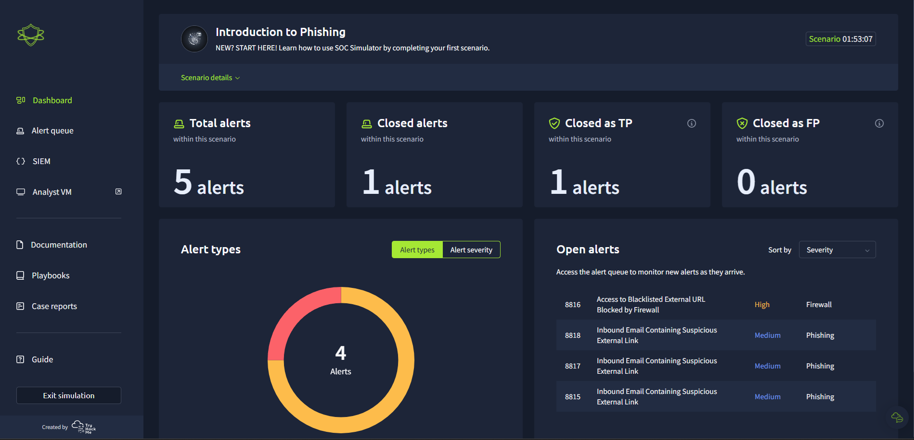
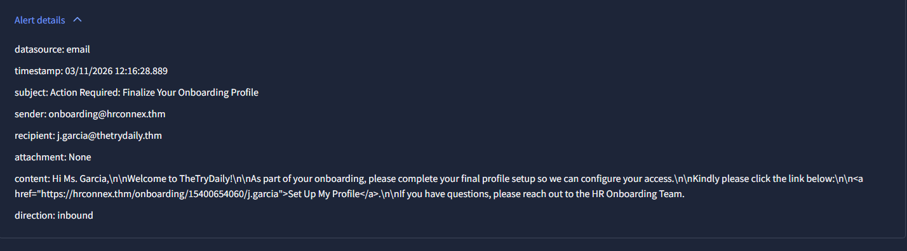

# 🛡️ SOC Analyst Investigation — Phishing Detection


---

## Overview

Completed a hands-on SOC Analyst simulation investigating real-world phishing scenarios using Splunk SIEM. Performed full alert triage, log analysis, threat classification, and incident reporting following industry standard SOC playbooks.

This project demonstrates my ability to think and operate as a Tier 1 SOC Analyst from receiving an alert all the way through to writing a professional case report.


---

## Tools Used

| Tool | Purpose |
|------|---------|
| Splunk SIEM | Log analysis and threat hunting |
| SOC Simulator (TryHackMe) | Alert triage simulation environment |
| Firewall Logs | Connection verification |
| Email Logs | Phishing investigation |
| Asset Inventory | Employee and host correlation |

---

## Skills Demonstrated

- Alert triage and prioritisation
- Splunk SIEM log analysis and query building
- Phishing email investigation and analysis
- IOC (Indicator of Compromise) identification
- Firewall log correlation
- Asset correlation (IP to employee mapping)
- Incident classification (True Positive / False Positive)
- Escalation decision making
- Professional SOC case report writing

---

## Investigation Information

| Alert ID | Type | Severity | Classification | Escalation Required |
|----------|------|----------|---------------|-------------------|
| 8814 | Phishing Email - Suspicious External Link | Medium | True Positive | No |



---

### Step 1 - Review The Alert
- Read the alert description and understand what triggered it
- Extract all IOCs (IPs, domains, URLs, email addresses)
- Cross reference affected entities with the asset inventory
- Form an initial Understanding

### Step 2 - Investigate in Splunk
- Build targeted queries based on the hypothesis
- Search email logs to confirm what arrived
- Search firewall logs to confirm what was clicked or connected
- Correlate findings across multiple log sources

### Step 3 - Write Case Report
- Classify as True Positive or False Positive with evidence
- Decide if escalation is required
- Document all IOCs found
- Recommend remediation actions

---

##  Alert 8814 — Phishing Email Investigation

### Alert Details

| Field | Value |
|-------|-------|
| Alert ID | 8814 |
| Alert Rule | Inbound Email Containing Suspicious External Link |
| Severity | Medium |
| Type | Phishing |
| Date | 03/11/2026 12:16:28 |

---

**3. Splunk — Email log results for hrconnex.thm**


---

**4. Splunk — Firewall logs confirming no connection from Julia's machine**


---

> 💡 **How to add your screenshots:**
> 1. Create a folder called `images` in your GitHub repository
> 2. Upload your screenshots and name them exactly as shown above
> 3. The images will automatically appear in place of the placeholders

---

### 📧 Email Analysis

When I opened the alert, I found the following email details:

| Field | Value |
|-------|-------|
| Sender | onboarding@hrconnex.thm |
| Recipient | j.garcia@thetrydaily.thm |
| Subject | Action Required: Finalize Your Onboarding Profile |
| Attachment | None |
| Suspicious URL | https://hrconnex.thm/onboarding/15400654060/j.garcia |
| Direction | Inbound |

---

### 🚩 Red Flags Identified

Before touching Splunk, I analysed the email and identified these red flags:

**1. Sender Domain Mismatch**
- Company domain = `thetrydaily.thm`
- Sender domain = `hrconnex.thm`
- A legitimate HR email would come from within the company domain

**2. Spear Phishing Indicator**
- The malicious URL contained the victim's username: `/j.garcia`
- This means the attacker specifically targeted Julia Garcia
- This is called Spear Phishing — a targeted attack on one specific person

**3. Urgency Tactic**
- Subject line says "Action Required"
- Email body pressures recipient to act immediately
- Classic social engineering tactic to bypass critical thinking

**4. External Domain in Link**
- The link redirects to `hrconnex.thm` — a completely external domain
- A legitimate onboarding link would point to `thetrydaily.thm`
- The random number `15400654060` in the URL is likely a tracking ID to identify who clicked

---

### 👤 Asset Correlation

Cross referenced the recipient with the company asset inventory:

| Field | Value |
|-------|-------|
| Full Name | Julia Garcia |
| Department | Content |
| Email | j.garcia@thetrydaily.thm |
| Hostname | win-3452 |
| IP Address | 10.20.2.8 |

> 💡 **Why this matters:** Splunk logs don't say "Julia clicked a link." They say "10.20.2.8 made a connection." Asset correlation lets me translate technical identifiers back to real people and machines. This is the first step before any Splunk query.

---

### 🔎 Splunk Investigation

#### ⚠️ Important Lesson — Field Names Vary By Environment
> Splunk field names are not universal. Every company configures them differently. In this environment the fields were `SourceIP`, `DestinationIP`, `URL`, `Action` instead of the standard `src_ip`, `dest_ip`, `url`, `action`. Always check the Fields Panel on the left side of Splunk before writing queries.

---

#### Query 1 — Broad Domain Search
**Purpose:** Find ALL logs mentioning the suspicious domain regardless of log source

```splunk
index=* "hrconnex.thm"
```

**Result:** Found 3 events — all from email datasource confirming the phishing email arrived in Julia's inbox

---

#### Query 2 — Check If Julia Clicked The Link
**Purpose:** Search firewall logs to see if Julia's machine made a connection to the attacker's domain

```splunk
index=* SourceIP="10.20.2.8" "hrconnex.thm"
```

**Result:** No results returned — no firewall connection logged from Julia's machine to hrconnex.thm

---

#### Query 3 — Verify Firewall Logging Is Active
**Purpose:** Before concluding Julia didn't click, verify that firewall logs are actually being recorded in Splunk

```splunk
index=* datasource="firewall"
```

**Result:** Firewall logs confirmed active and recording connections from other machines — proving the absence of results in Query 2 is meaningful

---

#### Investigation Conclusion

```
Email logs    → Phishing email arrived in Julia's inbox        ✅
Firewall logs → NO connection from 10.20.2.8 to hrconnex.thm  ✅
Conclusion    → Julia did not click the malicious link         ✅
```

> 💡 **Critical thinking moment:** Always verify your log source is working before concluding nothing happened. If I had skipped Query 3, I wouldn't know if firewall logging was broken or if Julia genuinely didn't click. Query 3 gave my conclusion credibility.

---

### 🧾 Case Report

---

**Time of Activity:**
03/11/2026 12:16:28

---

**List of Affected Entities:**
Julia Garcia | Content Department | Host: win-3452 | IP: 10.20.2.8

---

**Reason for Classifying as True Positive:**
This alert is classified as True Positive because a phishing email was sent from `onboarding@hrconnex.thm` to `j.garcia@thetrydaily.thm` containing a malicious URL `https://hrconnex.thm/onboarding/15400654060/j.garcia`. The email impersonated thetrydaily.thm company HR and created urgency by saying "please complete your final profile setup so we can configure your access."

---

**Reason for Not Escalating:**
Escalation is not required because Julia did not click the link. This was confirmed by searching firewall logs for connections from `10.20.2.8` to `hrconnex.thm` which returned no results, confirming no connection was established between Julia's machine and the attacker's domain. No unauthorised access occurred.

---

**Recommended Remediation Actions:**
- Block domain `hrconnex.thm` at the email gateway level
- Inform Julia Garcia about the phishing attempt and advise her to remain vigilant
- Alert all other team members about emails coming from this domain
- Alert the security team to monitor for further activity from this domain

---

**List of Attack Indicators (IOCs):**

| Indicator Type | Value |
|---------------|-------|
| Sender Email | onboarding@hrconnex.thm |
| Malicious URL | https://hrconnex.thm/onboarding/15400654060/j.garcia |
| Attacker Domain | hrconnex.thm |
| Tactic Used | Spear Phishing |
| Social Engineering | Urgency — "Action Required" subject line |

---

## 📁 Alert 8816 — Blacklisted URL Investigation

> 🔄 **Investigation in progress — to be updated**

---

## 📚 Key Learnings From This Project

### 1. Splunk Field Names Vary By Environment
Never assume field names. Always check the Fields Panel first. What is `src_ip` in one environment could be `SourceIP` in another.

### 2. No Results Does Not Mean Nothing Happened
Always verify your log source is working before concluding nothing happened. I confirmed firewall logs were active before concluding Julia didn't click.

### 3. Time Range Is Critical In Splunk
Splunk defaults to short time windows. Always adjust the time range to cover the alert timestamp or you will miss events entirely.

### 4. Classification Is About The Threat Not The Outcome
A phishing email is a True Positive whether the victim clicked or not. The attack was real. The outcome affects escalation, not classification.

### 5. Evidence Based Conclusions Only
Never guess. Every conclusion must be backed by log evidence. "Julia didn't click" is only valid because firewall logs proved it — not because we assumed it.

### 6. Asset Correlation Is The First Step
Logs speak in IPs and hostnames. Analysts speak in names and departments. The asset inventory bridges that gap and should always be checked before writing any Splunk query.

---

## 🔗 Resources

- [TryHackMe SOC Simulator](https://tryhackme.com)
- [Splunk Documentation](https://docs.splunk.com)
- [MITRE ATT&CK — Phishing](https://attack.mitre.org/techniques/T1566/)

---

## 👨‍💻 About Me

Cybersecurity enthusiast actively building hands-on SOC analyst skills through real-world simulations, home lab projects, and continuous learning.

- 🔗 [GitHub](https://github.com/Prajwal-Manjunath)
- 📧 Available for SOC Analyst / Security Analyst roles

---

*This project is part of my ongoing cybersecurity portfolio documenting hands-on security investigations and analysis.*
