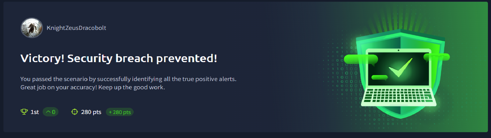

# 🛡️ SOC Analyst Investigation - Phishing Detection

---
## Scenario Result

> **Victory! Security breach prevented!**
> You passed the scenario by successfully identifying all the true positive alerts.

| Metric | Result |
|--------|--------|
| ⭐ Score | 280 points |
| 🔔 Alerts Closed | 5 / 5 |
| ⏱️ Mean Time To Resolve | 49 minutes |
| 🕐 Mean Dwell Time | 299 minutes |

---

## Overview

Completed a hands-on SOC Analyst simulation investigating real-world phishing scenarios using Splunk SIEM. Performed full alert triage, log analysis, threat classification, and incident reporting following industry standard SOC playbooks.

This project demonstrates my ability to think and operate as a Tier 1 SOC Analyst - from receiving an alert all the way through to writing a professional case report.

> **Detailed Investigation Writeup:**
> A full step-by-step investigation of Alert 8814 including Splunk queries, log analysis, IOC identification and case report is documented here:
> **[View Full Investigation →](https://github.com/Prajwal-Manjunath/SOC-Simulator-Challenges-TryHackMe/tree/main/Phishing%20Detection)**

---

##  Tools Used

| Tool | Purpose |
|------|---------|
| Splunk SIEM | Log analysis and threat hunting |
| SOC Simulator (TryHackMe) | Alert triage simulation environment |
| Firewall Logs | Connection verification |
| Email Logs | Phishing investigation |
| Asset Inventory | Employee and host correlation |

---

##  Skills Demonstrated

- Alert triage and prioritisation
- Splunk SIEM log analysis and query building
- Phishing email investigation and analysis
- IOC (Indicator of Compromise) identification
- Firewall log correlation
- Asset correlation (IP to employee mapping)
- Incident classification (True Positive / False Positive)
- Alert correlation - linking related alerts to same incident
- Escalation decision making
- Professional SOC case report writing

---

## 📊 Alert Triage Results

| Alert ID | Alert Rule | Severity | Type | Classification | Escalation | Time To Resolve |
|----------|-----------|----------|------|---------------|------------|----------------|
| 8814 | Inbound Email Containing Suspicious External Link | Medium | Phishing | True Positive | No | 88.68 min |
| 8815 | Inbound Email Containing Suspicious External Link | Medium | Phishing | True Positive | No | 21.3 min |
| 8816 | Access to Blacklisted External URL Blocked by Firewall | High | Firewall | True Positive | No | 68.38 min |
| 8817 | Inbound Email Containing Suspicious External Link | Medium | Phishing | True Positive | No | 30.27 min |
| 8818 | Inbound Email Containing Suspicious External Link | Medium | Phishing | True Positive | YES | 34.7 min |

---

## Alert Summaries

### Alert 8814 - Spear Phishing targeting Julia Garcia
- **What happened:** Attacker sent a targeted phishing email impersonating company HR from `onboarding@hrconnex.thm` to `j.garcia@thetrydaily.thm`
- **Technique:** Spear Phishing - victim's name personalised in URL `/j.garcia`
- **Outcome:** Julia did not click the link - confirmed via firewall logs
- **Classification:** True Positive - No Escalation

---

### Alert 8815 - Repeat Spear Phishing targeting Julia Garcia
- **What happened:** Same attacker sent Julia the identical phishing email again - 2nd attempt on same day
- **Technique:** Persistent Spear Phishing campaign
- **Outcome:** Julia did not click - threat contained
- **Classification:** True Positive - No Escalation

---

### Alert 8816 - Firewall blocked malicious URL access by Hannah Harris
- **What happened:** Firewall detected and blocked Hannah's machine attempting to connect to a known malicious URL
- **Technique:** Brand Impersonation - fake Amazon delivery email from `urgents@amazon.biz`
- **Outcome:** Hannah clicked the link but firewall blocked the connection
- **Classification:** True Positive - No Escalation

---

### Alert 8817 - Brand Impersonation Phishing targeting Hannah Harris
- **What happened:** Phishing email impersonating Amazon sent from `urgents@amazon.biz` to `h.harris@thetrydaily.thm`
- **Technique:** Brand Impersonation using lookalike domain `.biz` instead of `.com`
- **Outcome:** Hannah clicked but firewall blocked - no data transmitted
- **Classification:** True Positive - No Escalation
- **Alert Correlation:** Directly linked to Alert 8816 - same click, two different system alerts

---

### Alert 8818 - Microsoft Credential Harvesting targeting Charlotte Allen 
- **What happened:** Phishing email impersonating Microsoft sent from `no-reply@m1crosoftsupport.co` to `c.allen@thetrydaily.thm`. Charlotte clicked the link and the firewall ALLOWED the connection to a credential harvesting page
- **Technique:** Typosquatting -  `i` replaced with `1` in `m1crosoftsupport.co`
- **Outcome:** Charlotte connected to fake Microsoft login page - credentials likely harvested
- **Classification:** True Positive - **Escalation Required** 
- **Why Escalated:** Firewall allowed the connection unlike other alerts. Charlotte is in Web Development with access to company web infrastructure. Credentials considered compromised.

---

## 🔗 Attack Techniques Identified

| Technique | Alert | Description |
|-----------|-------|-------------|
| Spear Phishing | 8814, 8815 | Targeted attack using victim's personal details |
| Brand Impersonation | 8816, 8817 | Fake Amazon email using `amazon.biz` |
| Typosquatting | 8818 | `m1crosoftsupport.co` replacing `i` with `1` |
| Credential Harvesting | 8818 | Fake Microsoft login page stealing credentials |
| URL Shortening | 8816, 8817 | Using `bit.ly` to hide malicious destination |
| Alert Correlation | 8816/8817 | Two alerts from same incident |
| Urgency Tactics | All | "Action Required", "48 hours", "Unusual sign-in" |

---

---

*This project is part of my ongoing cybersecurity portfolio documenting hands-on security investigations and analysis.*
